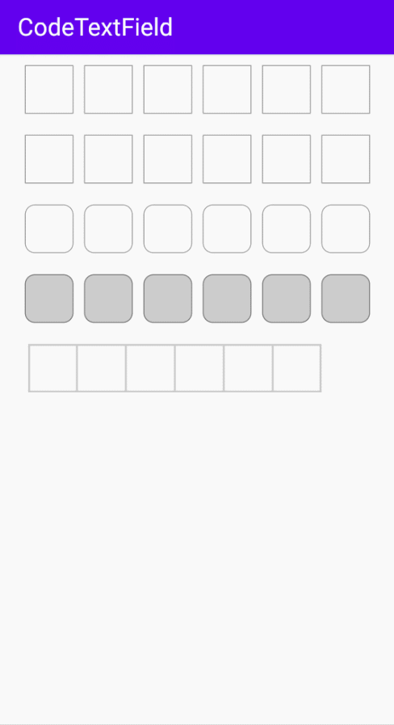

# CodeTextField

[](https://raw.githubusercontent.com/jenly1314/CodeTextField/master/app/release/app-release.apk)
[](https://repo1.maven.org/maven2/com/github/jenly1314/codetextfield)
[](https://jitpack.io/#jenly1314/CodeTextField)
[](https://circleci.com/gh/jenly1314/CodeTextField)
[](https://android-arsenal.com/api?level=21)
[](https://opensource.org/licenses/mit-license.php)

CodeTextField for Jetpack Compose；一个使用 Compose 实现的验证码输入框。

> 原生 **Android自定义View** 实现的可参见 [SplitEditText](https://github.com/jenly1314/SplitEditText)

## Gif 展示


> 你也可以直接下载 [演示App](https://raw.githubusercontent.com/jenly1314/CodeTextField/master/app/release/app-release.apk) 体验效果

## 引入

### Gradle:

1. 在Project的 **build.gradle** 或 **setting.gradle** 中添加远程仓库

    ```gradle
    repositories {
        //...
        mavenCentral()
    }
    ```

2. 在Module的 **build.gradle** 里面添加引入依赖项

    ```gradle
    implementation 'com.github.jenly1314:codetextfield:1.0.0'
    ```

## 使用

### 代码示例

```kotlin
    val text = remember {
        mutableStateOf("")
    }
    // 验证码输入框
    CodeTextField(value = text.value, onValueChange = {
        text.value = it
    })

```

更多使用详情，请查看[app](app)中的源码使用示例或直接查看 [API帮助文档](https://jitpack.io/com/github/jenly1314/CodeTextField/latest/javadoc/)

## 相关推荐

#### [SplitEditText](https://github.com/jenly1314/SplitEditText) 一个灵活的分割可编辑框；常常应用于 **验证码输入** 、**密码输入** 等场景。
#### [KingKeyboard](https://github.com/jenly1314/KingKeyboard) 一个自定义键盘，满足各种不同场景的键盘输入需求。
#### [compose-component](https://github.com/jenly1314/compose-component) 一个Jetpack Compose的组件库；主要提供了一些小组件，便于快速使用。

## 版本记录

#### v1.0.0：2022-11-20
*  CodeTextField初始版本

## 赞赏
如果您喜欢CodeTextField，或感觉CodeTextField帮助到了您，可以点右上角“Star”支持一下，您的支持就是我的动力，谢谢 :smiley:
<p>您也可以扫描下面的二维码，请作者喝杯咖啡 :coffee:

<div>
   
</div>

## 关于我

| 我的博客                                                                                | GitHub                                                                                  | Gitee                                                                                  | CSDN                                                                                 | 博客园                                                                            |
|:------------------------------------------------------------------------------------|:----------------------------------------------------------------------------------------|:---------------------------------------------------------------------------------------|:-------------------------------------------------------------------------------------|:-------------------------------------------------------------------------------|
| <a title="我的博客" href="https://jenly1314.github.io" target="_blank">Jenly's Blog</a> | <a title="GitHub开源项目" href="https://github.com/jenly1314" target="_blank">jenly1314</a> | <a title="Gitee开源项目" href="https://gitee.com/jenly1314" target="_blank">jenly1314</a>  | <a title="CSDN博客" href="http://blog.csdn.net/jenly121" target="_blank">jenly121</a>  | <a title="博客园" href="https://www.cnblogs.com/jenly" target="_blank">jenly</a>  |

## 联系我

| 微信公众号        | Gmail邮箱                                                                          | QQ邮箱                                                                              | QQ群                                                                                                                       | QQ群                                                                                                                       |
|:-------------|:---------------------------------------------------------------------------------|:----------------------------------------------------------------------------------|:--------------------------------------------------------------------------------------------------------------------------|:--------------------------------------------------------------------------------------------------------------------------|
| [Jenly666](http://weixin.qq.com/r/wzpWTuPEQL4-ract92-R) | <a title="给我发邮件" href="mailto:jenly1314@gmail.com" target="_blank">jenly1314</a> | <a title="给我发邮件" href="mailto:jenly1314@vip.qq.com" target="_blank">jenly1314</a> | <a title="点击加入QQ群" href="https://qm.qq.com/cgi-bin/qm/qr?k=6_RukjAhwjAdDHEk2G7nph-o8fBFFzZz" target="_blank">20867961</a> | <a title="点击加入QQ群" href="https://qm.qq.com/cgi-bin/qm/qr?k=Z9pobM8bzAW7tM_8xC31W8IcbIl0A-zT" target="_blank">64020761</a> |

<div>
   
</div>
